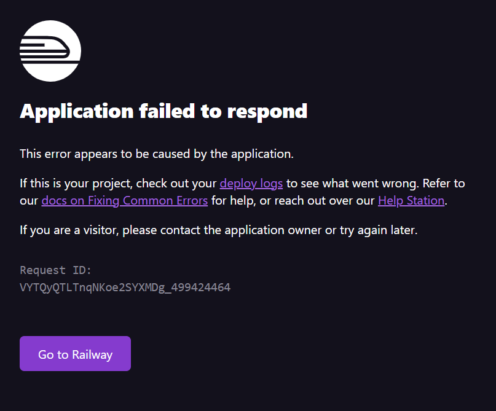

# Real Time Chat App - Technical Assignment

## Live demo
Here is the link where you can access the Real Time Chat App - Technical Assignment in order to test the application. This is the React client side of the application.

### [Real Time Chat App](https://chat-app-client.up.railway.app/)

`Note!` It may be possible that the first time you access the demo link, you will encounter an error message from the hosting service provider. This is normal as the resources are set in a sleeping state when not used. In order to wake them up, you simply need to refresh the page until the application's main screen loads.

The error message might look something similar to the following:

## Set up development environment

In order to set up the development environment, firs you need to make sure that you have the following prerequisites:

* npm -v 9.5.1 or equivalent
* node -v 18.16.0 or equivalent
* Visual Studio Code Editor (aka vscode) or any other preferred IDE
* git -v 2.29.2.windows.2 or any compatible alternative

## Steps:
### Step 1:
Clone the repository from GitHub into your local machine

### Step 2:
CD into the client directory and run the command npm install. Then run the client for development. This can be done by copying and running the following line into your terminal.
~~~~
cd /client && npm install && npm run dev
~~~~

### Step 3:
Now you need to move to the server directory and follow the same steps by running the same commands in order to start the server in developemnt mode. You can do this by running the following line into a new terminal window.
~~~~
cd /server && npm install && npm run dev
~~~~

Now you have set up your development environment and you can start or continue your development.

## Technilogies used

##### In this section we will take a look at the technologies used in the chat application and analyze briefly the technical implication choices that were made for each of the technologies used in the chat application

